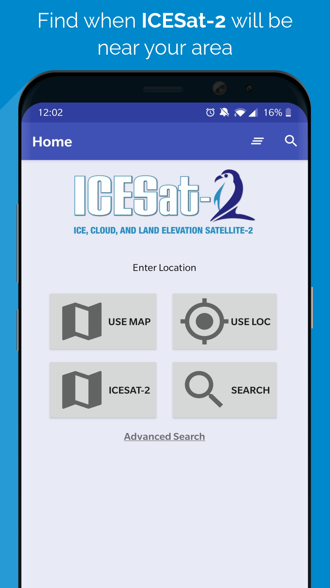
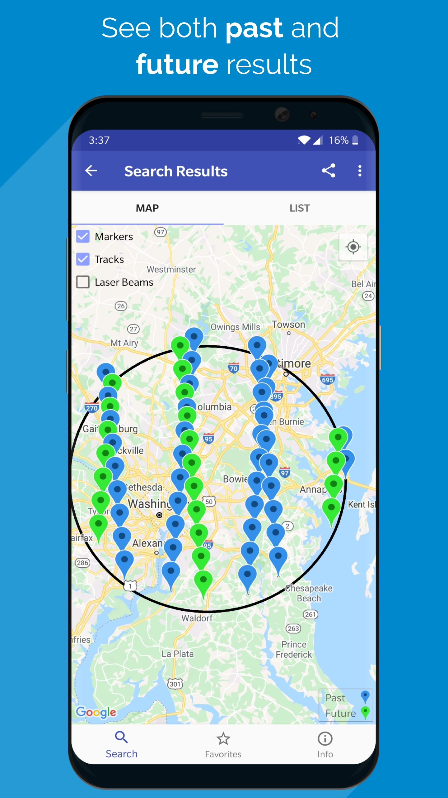
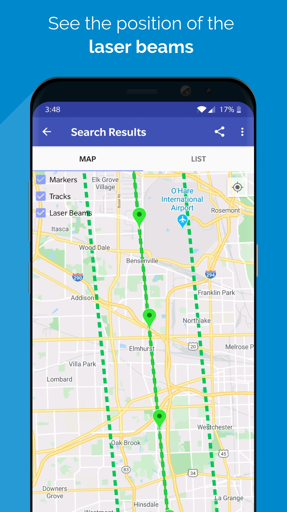
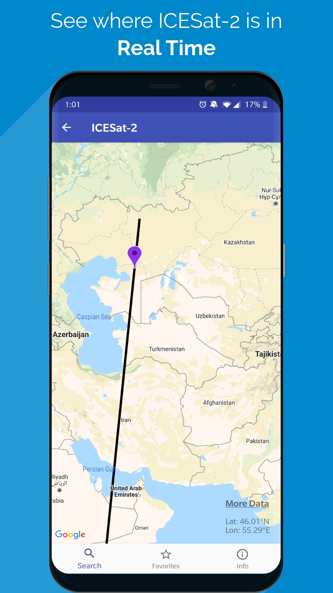
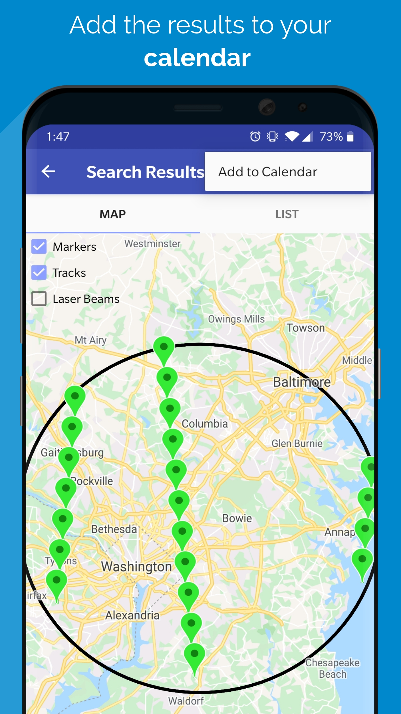
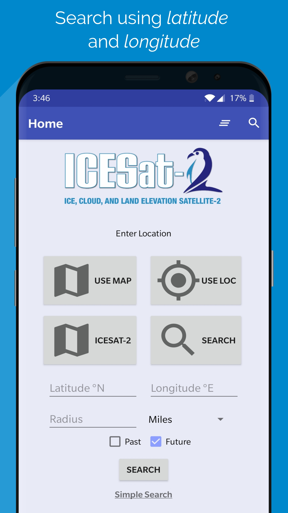
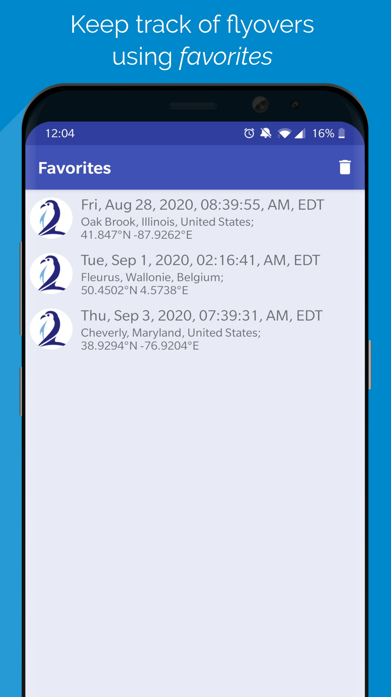
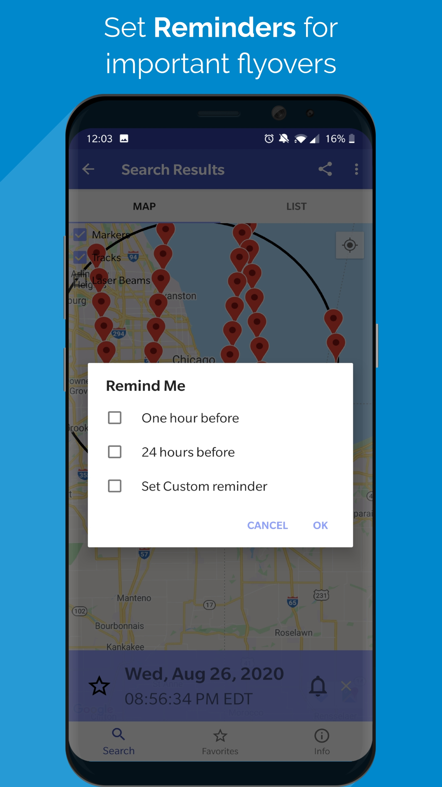

# ICESat-2-Android-App

This app was developed in Summer 2020 for the Crysopheric Sciences Laboratory at NASA Goddard Space Flight Center. It allows a user to determine when the [ICESat-2](https://icesat-2.gsfc.nasa.gov/) satellite will be near a particular area using the satellite's Refernce Ground Tracks. Practical applications extend to ground validation campaigns and to civilian scientists working with the Globe Earth app.

**Skills Used in this project**
- Kotlin - *Primary language used to create the app*
- Python - *Created script to convert KML files into csv files*
- Node.JS - *Created script that ran on AWS Elastic Beanstalk Environment to process search queries*
- Amazon Web Services - *Hosted a webserver to store satellite data*
- Google API Integration - *Integrated Google Maps API into the app*
- Basic SQL - *Stored important information for each user inside the app*

To run this app on an android device, download and install it from the [Google Play Store](https://play.google.com/store/apps/details?id=gov.nasa.gsfc.icesat2.icesat_2).
      
 

   
   
   

 

   
   
   

   
   

   
   
  

